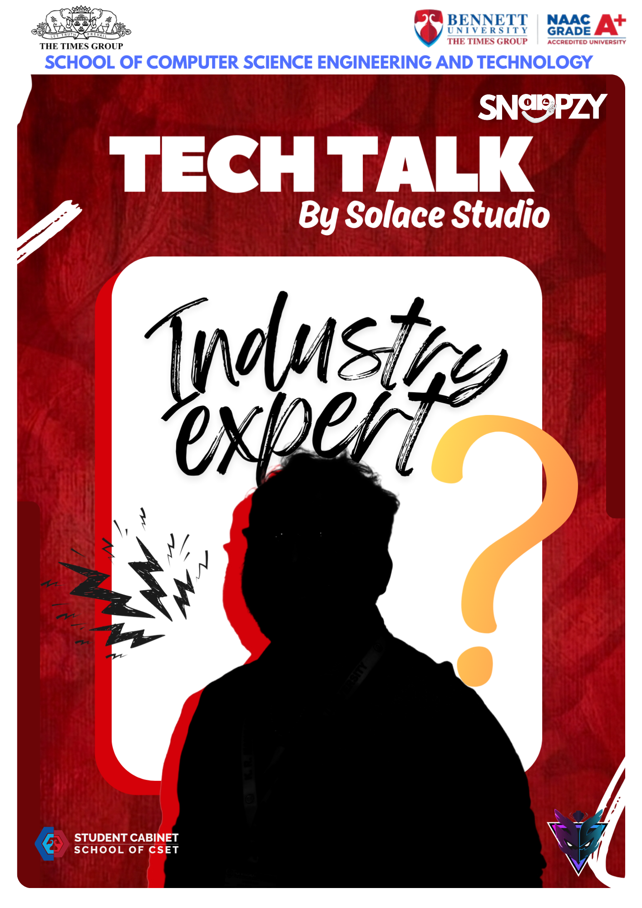

# 🎙️ Tech Talk Website

> A responsive event landing page built for **Tech Talk 2026** by **Solace Studios**, Bennett University. Features an auto-playing poster carousel and a one-click registration button.



---

## ✨ Features

- 🖼️ **Auto-rotating poster carousel** — 4 posters cycle every 3.5 seconds with a smooth fade transition
- 📊 **Progress bar** — visual timer showing when the next slide appears
- 🔴 **Matching red texture background** — seamlessly matches the poster aesthetic
- 📱 **Fully responsive** — on mobile, posters stack on top and register button appears below
- ⚡ **One-click registration** — links directly to a Google Form
- 🏷️ **Solace Studios branding** — logo + name displayed in the top-right corner
- 🎯 **Zero dependencies** — pure HTML, CSS, and vanilla JavaScript

---

## 📁 File Structure

```
/
├── index.html              # Main page
├── qwertyuiopnnnn.png      # Red texture background image
├── techtalk.png            # Poster 1 — Tech Talk main poster
├── introduce.png           # Poster 2 — Speaker introduction
├── Snaapzy.png             # Poster 3 — Snaapzy sponsor poster
├── poster4.png             # Poster 4 — Add your 4th poster here
└── Solace.PNG              # Club logo (top-right corner)
```

---

## ✏️ Customization

### Add or remove a poster

In `index.html`, find the carousel section and add/remove a slide:

```html
<div class="slide"></div>
```

The slide counter and dots update automatically via JavaScript.

### Change the registration link

Search for this line in `index.html` and replace the URL:

```javascript
window.location.href = "https://forms.gle/YOUR_FORM_LINK";
```

### Change the auto-play speed

Find this line near the top of the `<script>` tag:

```javascript
const DELAY = 3500; // milliseconds (3500 = 3.5 seconds)
```

---

## 🛠️ Built With

- HTML5
- CSS3 (Flexbox, CSS Variables, backdrop-filter)
- Vanilla JavaScript
- [Google Fonts](https://fonts.google.com/) — Bebas Neue + Outfit
- Hosted on [Netlify](https://netlify.com) (Free tier)

---

## 📸 Posters & Branding

All posters and branding assets are property of **Solace Studios**, Student Cabinet — School of CSET, Bennett University (The Times Group).

Sponsored by **Snaapzy**.

---

## 📄 License

This project is for club/educational use only. All poster designs and logos belong to their respective owners.

---

<p align="center">Made with ❤️ by Solace Studios · Bennett University</p>
